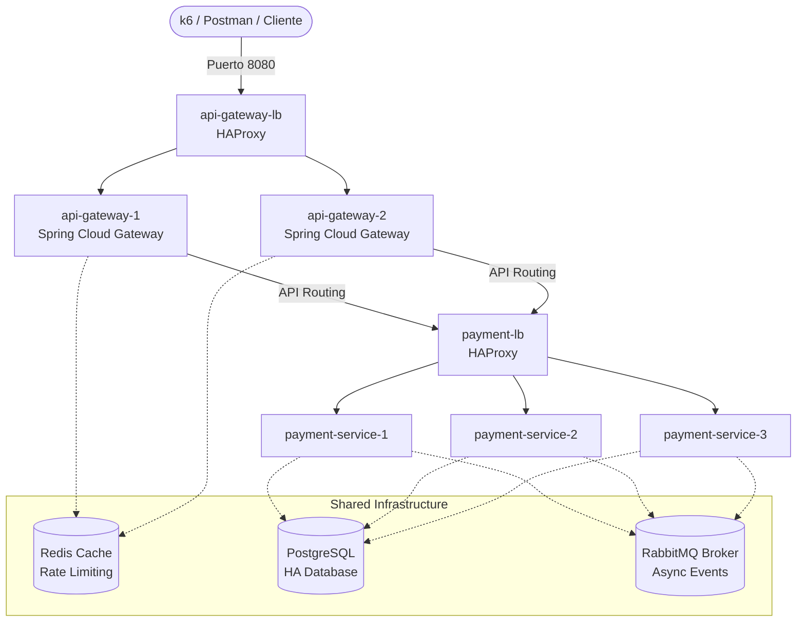

# 🏥 MediQueue Platform

> **Arquitectura de Microservicios Resiliente, de Alta Disponibilidad (HA) y Alta Escala para la Gestión de Citas y Colas Médicas.**

[](https://www.oracle.com/java/technologies/downloads/)
[](https://spring.io/projects/spring-boot)
[](https://spring.io/projects/spring-cloud)
[](https://www.docker.com/)
[](https://www.haproxy.org/)
[](https://k6.io/)

---


## 📌 Tabla de Contenidos
1. [📖 Introducción y Filosofía de Diseño](#-introducción-y-filosofía-de-diseño)
2. [📐 Arquitectura del Sistema](#-arquitectura-del-sistema)
3. [📂 Estructura del Monorepo](#-estructura-del-monorepo)
4. [🛠️ Requisitos del Entorno](#%EF%B8%8F-requisitos-del-entorno)
5. [🚀 Inicio Rápido](#-inicio-rápido)
6. [🔌 Mapeo de Puertos y Servicios](#-mapeo-de-puertos-y-servicios)
7. [🛡️ Resiliencia y Alta Disponibilidad (HA)](#%EF%B8%8F-resiliencia-y-alta-disponibilidad-ha)
   - [Balanceo de Carga y Failover del API Gateway](#balanceo-de-carga-y-failover-del-api-gateway)
   - [Balanceo de Carga y Failover del Payment Service](#balanceo-de-carga-y-failover-del-payment-service)
   - [Garantías de Consistencia e Idempotencia](#garantías-de-consistencia-e-idempotencia)
   - [Mensajería Confiable (Transactional Outbox Pattern)](#mensajería-confiable-transactional-outbox-pattern)
8. [📊 Observabilidad (Prometheus + Grafana)](#-observabilidad-prometheus--grafana)
9. [🧪 Pruebas de Carga (k6)](#-pruebas-de-carga-k6)
10. [🔌 Colección de Postman (Flujo E2E)](#-colección-de-postman-flujo-e2e)
11. [⚙️ Variables de Entorno](#%EF%B8%8F-variables-de-entorno)
12. [💻 Stack Tecnológico](#-stack-tecnológico)

---

## 📖 Introducción y Filosofía de Diseño

**MediQueue** no es solo un conjunto de microservicios CRUD. Es una **plataforma empresarial distribuida y de misión crítica** diseñada bajo los principios más estrictos de ingeniería de software moderna:

*   **SOLID Foundations & Clean Architecture:** El diseño de los servicios prioriza la separación de intereses, el acoplamiento débil y la alta cohesión.
*   **Resiliencia Nativa:** Implementación rigurosa de mecanismos de tolerancia a fallos (*Circuit Breakers*, *Rate Limiting*, *Retry policies*) utilizando **Resilience4j** y **Redis**.
*   **Alta Disponibilidad Real (HA):** Nada de puntos únicos de fallo (SPOF). Desde la entrada del API Gateway balanceada por **HAProxy**, hasta el procesamiento interno asíncrono y bases de datos robustas.
*   **Garantías Transaccionales Fuertes:** Procesamiento seguro de pagos utilizando el patrón **Transactional Outbox** con consultas atómicas (`SELECT FOR UPDATE SKIP LOCKED`) y llaves de idempotencia de extremo a extremo.

---

## 📐 Arquitectura del Sistema

La topología de red local de MediQueue implementa una infraestructura de balanceo de carga en capas lógicas:



---

## 📂 Estructura del Monorepo

MediQueue está organizado como un **Monorepo Maven modular**, permitiendo compartir lógica y optimizar la compilación de forma centralizada:

```text
mediqueue-platform/
├── pom.xml                          # POM padre (reactor)
├── docker-compose.yml               # Orquestación de infraestructura local completa
├── .env.example                     # Plantilla de variables de entorno de infraestructura
├── services/                        # Microservicios de Negocio
│   ├── api-gateway/                 # Spring Cloud Gateway + Resilience4j + Redis Rate Limiter
│   ├── appointment-service/         # Gestión del ciclo de vida de citas médicas
│   ├── notification-service/        # Consumidor asíncrono de eventos de RabbitMQ
│   ├── payment-service/             # Procesamiento seguro de transacciones monetarias
│   ├── patient-service/             # Administración de expedientes de pacientes
│   └── schedule-service/            # Planificación de agendas de doctores y slots
├── packages/                        # Librerías Compartidas
│   └── shared-lib/                  # Modelos de dominio compartido, DTOs y eventos nucleares
├── infra/                           # Configuración e Infraestructura como Código (IaC)
│   ├── docker/                      # Archivos de empaquetado Docker e inicialización SQL
│   ├── grafana/                     # Provisionamiento y dashboards prediseñados de Grafana
│   ├── prometheus/                  # Reglas de scrapeo e intervalos de Prometheus
│   ├── rabbitmq/                    # Configuraciones, exchanges, colas y plugins
│   ├── load-tests/                  # Suites avanzadas de pruebas de rendimiento (K6)
│   └── scripts/                     # Automatizaciones y herramientas del sistema
├── tests/                           # Pruebas End-to-End
│   └── load-test.js                 # Prueba de rendimiento principal del sistema
└── docs/                            # Documentación y Colecciones API
    └── MediQueue.postman_collection.json  # Suite de pruebas E2E en Postman
```

---

## 🛠️ Requisitos del Entorno

Asegúrate de contar con las siguientes dependencias instaladas en tu máquina local:

*   **Java Development Kit (JDK):** Versión **21** (LTS)
*   **Apache Maven:** Versión **3.9+**
*   **Docker Engine & Docker Compose:** Para la orquestación del stack de infraestructura
*   **k6 CLI:** Para la ejecución local de las pruebas de estrés ([Instrucciones de instalación](https://k6.io/docs/getting-started/installation/))

---

## 🚀 Inicio Rápido

Sigue estos pasos para compilar, levantar y verificar la salud de la plataforma completa en minutos:

### 1. Preparar Entorno
Copia la configuración base de las variables de entorno:
```bash
cp .env.example .env
```

### 2. Compilar el Reactor Monorepo
Compila y empaqueta todos los módulos del sistema saltando las pruebas unitarias rápidas:
```bash
mvn clean install -DskipTests
```

> [!TIP]
> **¿Quieres compilar un solo microservicio?** No necesitas compilar todo el proyecto. Ejecuta:
> ```bash
> mvn -pl services/appointment-service -am clean package -DskipTests
> ```

### 3. Desplegar Infraestructura y Microservicios
Levanta todo el stack local orquestado en segundo plano:
```bash
docker compose up -d --build
```

### 4. Monitorear Inicialización y Salud (Health Checks)
Verifica que cada uno de los microservicios haya alcanzado un estado saludable mediante sus Actuators lógicos:

```bash
# Gateway y Balanceador
curl http://localhost:8080/actuator/health

# Microservicios de Negocio
curl http://localhost:8081/actuator/health   # Appointment Service
curl http://localhost:8082/actuator/health   # Notification Service
curl http://localhost:8083/actuator/health   # Payment Service
curl http://localhost:8084/actuator/health   # Patient Service
curl http://localhost:8085/actuator/health   # Schedule Service
```

---

## 🔌 Mapeo de Puertos y Servicios

La siguiente tabla describe la asignación de puertos expuestos por la infraestructura de MediQueue:

| Servicio / Componente | Puerto Externo | Puerto Interno | Tipo | Descripción |
| :--- | :---: | :---: | :---: | :--- |
| **`api-gateway-lb`** | `8080` | `8080` | HAProxy | Entrada principal balanceada de la red externa |
| **`api-gateway`** | *Interno* | `8080` | Gateway | Spring Cloud Gateway (escalable dinámicamente) |
| **`appointment-service`** | `8081` | `8080` | Spring Boot | API REST para gestión de citas médicas |
| **`notification-service`**| `8082` | `8080` | Spring Boot | Procesador asíncrono de eventos del sistema |
| **`payment-service`** | `8083` | `8080` | Spring Boot | Procesamiento y balanceo directo de pagos |
| **`patient-service`** | `8084` | `8080` | Spring Boot | Gestión y control de expedientes de pacientes |
| **`schedule-service`** | `8085` | `8080` | Spring Boot | Control de horarios y asignación de slots |
| **PostgreSQL** | `5432` | `5432` | DB | Motor de base de datos relacional principal |
| **Redis** | `6379` | `6379` | Cache/Store | Motor en memoria para Rate Limiting y Caché |
| **RabbitMQ Broker** | `5672` | `5672` | Broker | Protocolo de mensajería (AMQP) |
| **RabbitMQ Management**| `15672` | `15672` | Web UI | Consola web de administración de RabbitMQ |
| **Prometheus** | `9090` | `9090` | Monitor | Motor de recolección de métricas de series temporales |
| **Grafana** | `3000` | `3000` | Analytics | Visualizador web de dashboards de observabilidad |

---

## 🛡️ Resiliencia y Alta Disponibilidad (HA)

### Balanceo de Carga y Failover del API Gateway

El API Gateway no debe representar un SPOF (punto único de fallo). En el archivo `docker-compose.yml`, el servicio `api-gateway` ya no publica su puerto directo en la máquina host. En su lugar, el balanceador de carga frontal de **HAProxy** (`api-gateway-lb`) actúa como entrada en el puerto `8080` y redistribuye el tráfico hacia todas las réplicas del gateway.

```text
Cliente / k6 / Postman
      |
      v
[ api-gateway-lb:8080 (HAProxy) ]
      |
      +---> [ api-gateway réplica 1 ] (Spring Cloud Gateway)
      +---> [ api-gateway réplica 2 ] (Spring Cloud Gateway)
```

Las instancias de API Gateway comparten una caché de **Redis** distribuida en el backend para orquestar el límite de peticiones (*Rate Limiting*).

#### ¿Cómo escalar y probar la tolerancia a fallos del Gateway?

1.  **Escalar el Gateway a 2 réplicas y Payment a 3 réplicas:**
    ```bash
    docker compose up -d --build --scale api-gateway=2 --scale payment-service=3
    ```
2.  **Verificar el estado operacional del clúster:**
    ```bash
    docker compose ps
    ```
3.  **Probar peticiones a través de la ruta del balanceador:**
    ```bash
    curl http://localhost:8080/actuator/health
    ```
4.  **Simular una caída matando una réplica de forma intempestiva:**
    ```bash
    # Buscar el ID del contenedor del gateway
    docker ps --filter "name=api-gateway"
    # Matar uno de los nodos
    docker kill <id_contenedor>
    ```
5.  **Verificar continuidad de servicio:**
    Ejecuta nuevamente peticiones hacia `http://localhost:8080/api/...`. El balanceador redirigirá automáticamente el 100% de la carga al nodo superviviente en milisegundos, manteniendo el sistema **100% disponible**.

---

### Balanceo de Carga y Failover del Payment Service

El microservicio de pagos (`payment-service`) está protegido detrás de su propio balanceador de carga interno **HAProxy** (`payment-lb`). Toda petición dirigida a pagos enviada por el API Gateway fluye a través de este balanceador:

```text
[ api-gateway-lb ]
       |
       v
[ api-gateway ]
       |
       v
[ payment-lb (HAProxy) ] ---> [ payment-service réplica 1 ]
                         ---> [ payment-service réplica 2 ]
                         ---> [ payment-service réplica 3 ]
```

#### ¿Cómo probar el Failover de pagos?

1.  **Monitorear logs en caliente de todas las réplicas de pago:**
    ```bash
    docker compose logs -f payment-service
    ```
2.  **Monitorear logs del balanceador interno de pagos (HAProxy):**
    ```bash
    docker logs -f mediqueue-payment-lb
    ```
3.  **Matar un nodo de pagos activo:**
    ```bash
    docker kill <container_id_de_payment_service>
    ```
4.  **Confirmar la consistencia:**
    El sistema sigue procesando pagos con normalidad sin retornar errores HTTP `502 Bad Gateway` ni `503 Service Unavailable`.

---

### Garantías de Consistencia e Idempotencia

El escalamiento horizontal introduce el riesgo de duplicación y condiciones de carrera. MediQueue implementa una estrategia defensiva en múltiples niveles:

1.  **Idempotencia a Nivel de Aplicación (`X-Idempotency-Key`):**
    Toda transacción crítica (por ejemplo, pagos o creación de citas) requiere un encabezado HTTP `X-Idempotency-Key` único. Los microservicios validan y registran el estado de esta clave en **Redis** de forma distribuida para descartar ejecuciones duplicadas de peticiones repetidas.
2.  **Consistencia Estricta de Base de Datos (PostgreSQL constraints):**
    Para evitar que múltiples transacciones concurrentes aprueben más de un pago para una misma cita (`appointmentId`), la base de datos cuenta con un **índice único parcial**:
    ```sql
    CREATE UNIQUE INDEX idx_payment_appointment_approved 
    ON payments(appointment_id) 
    WHERE status = 'APPROVED';
    ```
    Si dos réplicas intentan aprobar de forma simultánea un pago para la misma cita, una de las transacciones fallará a nivel ACID, protegiendo la integridad del dinero.

---

### Mensajería Confiable (Transactional Outbox Pattern)

Para el envío de eventos asíncronos a RabbitMQ (por ejemplo, notificar la aprobación de un pago), MediQueue implementa el patrón **Transactional Outbox**.

> [!IMPORTANT]
> **¿Por qué evitar la publicación directa de eventos dentro de la transacción de negocio?**
> Si la base de datos confirma la transacción pero la red con RabbitMQ falla, el evento se pierde. Si la red es exitosa pero la base de datos hace Rollback, enviamos un evento falso. **El Outbox pattern resuelve esto guardando el evento en una tabla local `outbox` en la misma transacción ACID de negocio.**

Un hilo de fondo (*Outbox Worker*) consulta periódicamente la tabla para despachar los mensajes pendientes. En un entorno distribuido altamente concurrente con múltiples réplicas del microservicio activas, el worker evita la doble publicación de eventos mediante bloqueos optimizados de base de datos:

```sql
SELECT * FROM outbox_table
WHERE processed = false
LIMIT 100
FOR UPDATE SKIP LOCKED;
```

`FOR UPDATE SKIP LOCKED` asegura que:
1.  La réplica A bloquee una serie de registros para su procesamiento.
2.  La réplica B, al ejecutar el query, ignore por completo los registros bloqueados por la réplica A, evitando esperas inactivas y procesamiento duplicado de eventos.

---

## 📊 Observabilidad (Prometheus + Grafana)

MediQueue expone métricas en formato estándar de Prometheus y cuenta con provisionamiento automático de dashboards en Grafana.

*   **Prometheus Console:** [http://localhost:9090](http://localhost:9090)
*   **Grafana Dashboard:** [http://localhost:3000](http://localhost:3000)
    *   *Credenciales por defecto:* Usuario: `admin` | Contraseña: `admin`

```text
                     [ Métricas Actuator ]
                              |
                              v
Microservicios  ---->  [ Prometheus ]  ---->  [ Grafana Dashboards ]
```

### Dashboards Disponibles
El panel **"MediQueue Resilient - Dashboard Principal"** incluye métricas críticas en tiempo real:
*   **Tráfico & Rendimiento:** Requests por segundo (RPS) por servicio lómico.
*   **Tasas de Error:** Distribución porcentual y volumen de errores HTTP 5xx y 4xx.
*   **Latencias de Extremo a Extremo:** Histogramas percentiles p50, p95 y p99.
*   **Colas de Mensajería:** Profundidad y estado de mensajes en tránsito dentro de RabbitMQ.
*   **Salud de Recursos Físicos:** Uso de memoria Heap JVM, consumo de CPU y cantidad de réplicas activas.
*   **Pool de Conexiones (HikariCP):** Conexiones activas, inactivas y en cola de espera.

---

## 🧪 Pruebas de Carga (k6)

MediQueue cuenta con un suite robusto de pruebas de estrés para validar el comportamiento del sistema bajo límites hostiles.

### 1. Ejecución de la Suite Secuencial por Microservicio
La suite integrada en `infra/load-tests` ejecuta fases ordenadas simulando tráfico real:

```bash
# Levantar el clúster escalado
docker compose up -d --build --scale api-gateway=2 --scale payment-service=3

# Ejecutar el smoke test rápido de sanidad
k6 run infra/load-tests/scripts/00-smoke.js

# Ejecutar el script secuencial completo de rendimiento (Linux/macOS)
./infra/load-tests/run-sequential.sh
```

En sistemas Windows (PowerShell):
```powershell
.\infra\load-tests\run-sequential.ps1
```

Si prefieres ejecutar el test usando un contenedor de Docker aislado:
```bash
docker compose --profile loadtest run --rm k6 run /scripts/scripts/00-smoke.js
```

### 2. Prueba Principal de Alta Concurrencia (Raíz)
Ejecuta la prueba de carga en el monorepo para verificar la estabilidad general:

```bash
# Ejecución básica estándar
k6 run tests/load-test.js

# Apuntar a un Gateway URL personalizado
k6 run --env GATEWAY_URL=http://localhost:8080 tests/load-test.js

# Prueba de estrés de alta concurrencia extrema (50,000 iteraciones en 100 Virtual Users concurrentes)
k6 run --iterations 50000 --vus 100 tests/load-test.js
```

### 3. Escenarios Avanzados de Carga Específica
Valida el comportamiento del sistema ante condiciones críticas particulares:

```bash
# Escenario A: Consulta de slots médicos bajo alto tráfico de lectura
k6 run infra/load-tests/scenario-a-slots.js

# Escenario B: Concurrencia extrema sobre operaciones transaccionales críticas
k6 run infra/load-tests/scenario-b-concurrency.js

# Escenario C: Flujo completo End-to-End con inyección inducida de fallos (Chaos Engineering)
k6 run infra/load-tests/scenario-c-full-flow.js
```

> [!NOTE]
> Todos los reportes estructurados se almacenan automáticamente en formato JSON dentro de `tests/results/` e `infra/load-tests/results/` para su posterior análisis comparativo.

---

## 🔌 Colección de Postman (Flujo E2E)

El archivo `docs/MediQueue.postman_collection.json` contiene la colección de pruebas lógicas del sistema de extremo a extremo.

### ¿Cómo importar y ejecutar?
1.  Abre la aplicación de **Postman**.
2.  Presiona el botón **Import** y selecciona el archivo `docs/MediQueue.postman_collection.json`.
3.  La suite está pre-configurada con variables dinámicas de entorno que se propagan de forma transparente entre peticiones sucesivas.
4.  Haz clic derecho sobre la colección importada y presiona **Run Collection**.

### Flujo Operacional de Pruebas

Ejecuta las peticiones **en estricto orden secuencial** para satisfacer las precondiciones de negocio:

| Paso | Petición | Método | Endpoint de Red | Propósito del Test |
| :---: | :--- | :---: | :--- | :--- |
| **0** | Health Check | `GET` | `/actuator/health` | Valida que el API Gateway esté respondiendo |
| **1** | Crear Paciente | `POST` | `/api/patients` | Registra un nuevo paciente y almacena su UUID |
| **2** | Crear Dentista | `POST` | `/api/dentists` | Registra un nuevo doctor en la red médica |
| **3** | Crear Slot | `POST` | `/api/slots` | Libera un slot horario para reservaciones médicas |
| **4** | Crear Cita | `POST` | `/api/appointments` | Reserva la cita asignando el slot con clave de idempotencia |
| **5** | Consultar Pago | `GET` | `/api/payments?appointmentId={{id}}` | Verifica la creación del estado de pago asociado a la cita |
| **6** | Consultar Cita | `GET` | `/api/appointments/{{id}}` | Inspecciona el estado actualizado de la cita médica |
| **7** | Notificaciones | `GET` | `/api/notifications/patient/{{id}}` | Comprueba que el evento asíncrono de notificación haya llegado |
| **8** | Test Idempotencia | `POST` | `/api/appointments` | Re-envía el payload con la misma key; valida respuesta `200` o `409` |

---

## ⚙️ Variables de Entorno

Antes de iniciar el sistema, puedes configurar las credenciales y variables críticas del entorno creando un archivo local `.env`. El sistema utiliza las siguientes claves estándar por defecto:

| Variable de Entorno | Valor por Defecto | Propósito / Descripción |
| :--- | :---: | :--- |
| `DB_USERNAME` | `mediqueue` | Nombre de usuario de la base de datos PostgreSQL |
| `DB_PASSWORD` | `mediqueue` | Contraseña asociada al usuario de PostgreSQL |
| `REDIS_PASSWORD` | `redis123` | Clave de acceso segura al clúster de caché Redis |
| `RABBITMQ_USER` | `mediqueue` | Nombre de usuario administrador de RabbitMQ |
| `RABBITMQ_PASSWORD` | `rabbit123` | Contraseña administrativa del broker RabbitMQ |
| `GRAFANA_USER` | `admin` | Usuario administrador para la consola web de Grafana |
| `GRAFANA_PASSWORD` | `admin` | Contraseña del administrador de Grafana |

---

## 💻 Stack Tecnológico

La plataforma MediQueue está construida sobre un conjunto de tecnologías robustas y probadas en entornos de producción a gran escala:

*   **Spring Boot 3.5.14** & **Spring Cloud 2025.0.2:** Núcleo de microservicios y enrutamiento inteligente del API Gateway.
*   **Java 21 (LTS):** Lenguaje moderno que permite el uso de Records, Pattern Matching y Virtual Threads.
*   **PostgreSQL 16:** Base de datos relacional robusta con soporte transaccional ACID estricto.
*   **Redis 7:** Almacenamiento rápido en memoria para Rate Limiting distribuido e idempotencia veloz.
*   **RabbitMQ 3.13:** Message broker para orquestación asíncrona de eventos con baja latencia.
*   **Flyway Database Migrations:** Control de versiones del esquema relacional y evolución estructurada.
*   **Resilience4j:** Implementación de cortocircuitos (*Circuit Breaker*), reintentos y límites de concurrencia.
*   **Micrometer + Prometheus + Grafana:** Trilogía para telemetría, scrapeo y visualización de métricas avanzadas.
*   **k6 CLI:** Suite de simulación de carga e inyección de estrés para pruebas de Chaos Engineering.

---

<p align="center">
  Diseñado con ❤️ por el equipo de ingeniería de <b>MediQueue</b>. Todos los derechos reservados.
</p>
